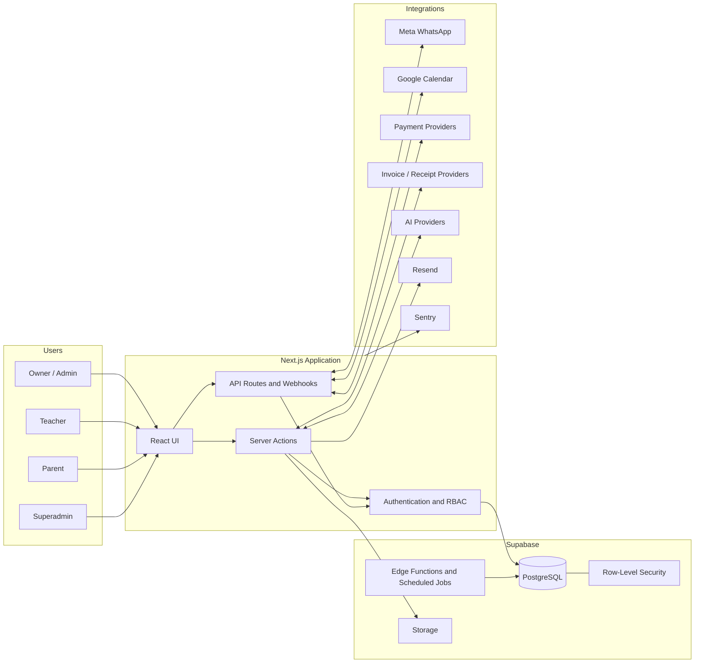

<div align="center">

# Lessio

### Multi-tenant operations platform for tutoring businesses

Lessio brings scheduling, billing, communication, learning operations and business reporting into one structured system.


</div>

## Overview

Lessio is a production-oriented SaaS application designed for tutoring schools and independent teaching businesses.

It replaces fragmented spreadsheets, manual WhatsApp coordination, disconnected calendars and repetitive billing work with a single multi-role platform for owners, administrators, teachers and parents.

The project covers the full operational lifecycle:

- capturing and converting leads;
- managing students, parents, teachers and groups;
- scheduling individual, group and recurring lessons;
- calculating monthly billing and cancellation adjustments;
- sending reminders, payment requests and operational messages;
- tracking homework, exams and student progress;
- producing business, revenue and teacher-performance insights;
- managing organizations, plans, quotas and integrations as a SaaS platform.

## My Role

I designed and developed Lessio end to end, from business-process mapping and product architecture to implementation, integration, testing and deployment preparation.

My work included:

- translating real tutoring-business workflows into system requirements;
- designing the multi-tenant data model and role-based access rules;
- building the Next.js application and Supabase backend;
- implementing third-party API integrations and webhook flows;
- creating billing, scheduling and communication engines;
- hardening production paths with validation, idempotency, encryption, monitoring and tests;
- iterating through complex operational edge cases such as cancellations, calendar conflicts, duplicate webhook events and tenant-specific credentials.

## Core Capabilities

### Scheduling and teaching operations

- Single, group and recurring lesson scheduling
- Teacher availability, date-specific overrides and organization holidays
- Conflict detection, including Google Calendar conflicts
- Teacher self-service portal and scoped schedule views
- Parent portal with OTP authentication
- Homework assignments, reminders and completion tracking
- Student exams, progress reports and PDF delivery
- Student groups and group-pricing workflows

### Billing and payments

- Monthly student billing engine
- Subscription and package management
- Cancellation-policy calculations and manual adjustments
- Charge approval, payment tracking and payment reminders
- Payment-provider abstraction with tenant-specific configuration
- Invoice, receipt and credit-note generation workflows
- Accounting exports and billing history
- Separate SaaS-subscription billing for Lessio organizations

### WhatsApp and automation

- Per-organization Meta WhatsApp Cloud API connection
- Meta Embedded Signup flow
- Encrypted tenant credentials
- Lead capture and duplicate prevention
- Lesson, homework and payment reminders
- Parent booking and cancellation flows
- Organization-specific message templates
- Smart handling of Meta's 24-hour messaging window
- AI fallback assistant for unrecognized parent questions
- Conversation logging, safety limits and human fallback behavior

### SaaS platform management

- Multi-tenant organization isolation
- Owner, admin, teacher and superadmin roles
- Read-only superadmin support mode
- Guided onboarding and data-import flows
- Plan-based feature gates and resource quotas
- Hebrew and English interfaces with RTL/LTR support
- Organization-level settings and integration management
- GDPR-oriented export, retention and anonymization flows
- Platform analytics and organization oversight

### Analytics and reporting

- Operational KPI dashboard
- Revenue trends and monthly forecasting
- Lead-conversion tracking
- Teacher performance and cancellation analysis
- Student lifetime value
- Revenue, debt-aging, student and teacher reports
- CSV and PDF exports

## Architecture



## Engineering Highlights

### Tenant isolation

The authenticated session resolves the organization on the server. Organization identifiers are not trusted when supplied by the client, and database access is scoped by tenant and protected with Supabase Row-Level Security.

### Secure integration configuration

Per-organization WhatsApp and payment credentials are encrypted at the application layer using AES-256-GCM before storage. Sensitive configuration remains server-side.

### Reliable webhook processing

Inbound WhatsApp events use an idempotency layer to prevent duplicate processing. Retryable failures release the processing claim, while duplicate events return successfully so the provider stops retrying.

### Extensible provider architecture

Payments and receipt generation use adapter-style interfaces, allowing providers to be selected and configured without coupling the core billing engine to one vendor.

### Background automation

Supabase Edge Functions and scheduled jobs handle recurring operational work such as lesson reminders, payment reminders, homework reminders, retention tasks and SaaS subscription checks.

### Production hardening

The project includes schema validation, role and mutation guards, structured error handling, error boundaries, Sentry monitoring, automated tests and CI configuration.

## Technology Stack

| Area | Technologies |
|---|---|
| Frontend | Next.js 16, React 19, TypeScript, Tailwind CSS, Radix UI, shadcn/ui |
| Backend | Next.js Server Actions, API routes, Supabase Edge Functions |
| Data | Supabase, PostgreSQL, Row-Level Security, Supabase Storage |
| Authentication | Supabase Auth, Google OAuth, OTP and signed support sessions |
| Automation | Webhooks, scheduled Edge Functions, WhatsApp workflows |
| Integrations | Meta WhatsApp Cloud API, Google APIs, Stripe, Cardcom, Sumit, iCount, Green Invoice, Resend |
| AI | OpenAI, Anthropic and Gemini SDK integrations |
| Validation and testing | Zod, Vitest, Testing Library |
| Monitoring and delivery | Sentry, GitHub Actions, Vercel-oriented deployment |
| Internationalization | next-intl, Hebrew and English, RTL/LTR layouts |

## Repository Structure

```text
lessio/
├── src/
│   ├── app/                 # Application routes, dashboards, portals and API handlers
│   ├── components/          # Shared and domain-specific UI components
│   ├── lib/                 # Business logic, integrations, auth, billing and reports
│   └── i18n/                # Locale configuration
├── supabase/
│   ├── migrations/          # Database schema and policy migrations
│   └── functions/           # Background and scheduled Edge Functions
├── messages/                # Hebrew and English translation files
├── docs/                    # Architecture decisions, sprint scopes and release documentation
└── tests and *.test.ts      # Unit and integration tests near the relevant modules
```

## Local Development

### Prerequisites

- Node.js
- npm
- A Supabase project or local Supabase environment
- Credentials for any external integrations you choose to enable

### Setup

```bash
git clone https://github.com/HadarguetaTur/lessio.git
cd lessio
npm install
cp .env.local.example .env.local
npm run dev
```

Open `http://localhost:3000` in your browser.

The application requires environment configuration for Supabase and for any enabled external services. Never commit real credentials.

### Available scripts

```bash
npm run dev            # Start the development server
npm run build          # Create a production build
npm run start          # Start the production server
npm run lint           # Run ESLint
npm run test           # Run the Vitest suite
npm run test:watch     # Run tests in watch mode
npm run test:coverage  # Generate test coverage
```

## Project Status

Lessio is an actively developed portfolio and product project. The repository demonstrates a broad production-oriented implementation, while a real deployment still depends on environment configuration, provider onboarding and operational release checks.

## What This Project Demonstrates

Lessio is not a single-purpose demo. It demonstrates my ability to:

- understand a complex business operation;
- model interconnected data and permissions;
- design an extensible SaaS architecture;
- build full-stack product features;
- integrate external APIs safely;
- automate high-volume operational workflows;
- debug real edge cases across multiple systems;
- carry a product from initial requirements toward production readiness.

## Author

**Hadar Gueta**  
Automation & AI Solutions Engineer

- GitHub: [@HadarguetaTur](https://github.com/HadarguetaTur)
- Email: [hadart20@gmail.com](mailto:hadart20@gmail.com)

---

Copyright © 2026 Hadar Gueta. All rights reserved. This repository is shared for portfolio and evaluation purposes; no license is granted for commercial reuse.
